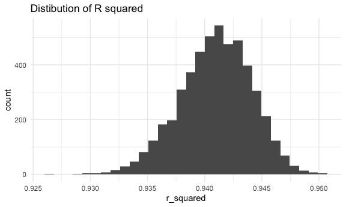
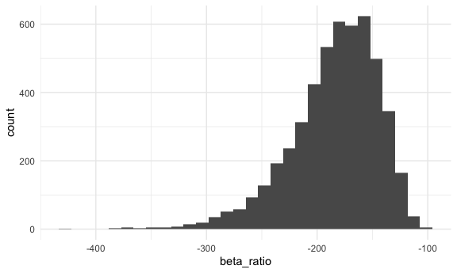
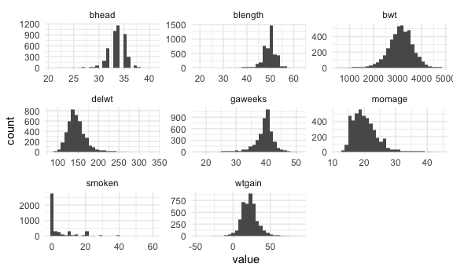
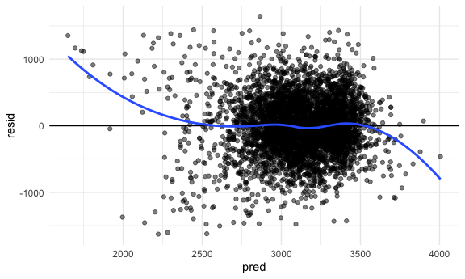

p8105_hw6_yh3824
================
ruby
2025-11-18

load packages/formatting

``` r
library(tidyverse)
library(mgcv)
library(modelr)


knitr::opts_chunk$set(
  fig.width = 6,
  fig.asp = .6,
  out.width = "90%"
)

theme_set(theme_minimal() + theme(legend.position = "bottom"))

options(
  ggplot2.continuous.colour = "viridis",
  ggplot2.continuous.fill = "viridis"
)

scale_colour_discrete = scale_colour_viridis_d
scale_fill_discrete = scale_fill_viridis_d

set.seed(1)
```

## Problem 1

import `homicide` data

``` r
homicide_df = read_csv(file = "./data/homicide-data.csv")
```

Create a `city_state` variable, filtering, make resolved vs unresolved
variable

``` r
homicide_df = 
  homicide_df |> 
    mutate(
      city_state = paste(city, state, sep = ", "),
      victim_age = as.numeric(victim_age),
      resolved = if_else(str_detect(disposition, "Closed"), 1, 0) 
    ) |> 
  filter(!city_state %in% c("Dallas, TX", "Phoenix, AZ", "Kansas City, MO", "Tulsa, AL"),
         victim_race %in% c("White", "Black"),
         is.numeric(victim_age)) 
```

    ## Warning: There was 1 warning in `mutate()`.
    ## ℹ In argument: `victim_age = as.numeric(victim_age)`.
    ## Caused by warning:
    ## ! NAs introduced by coercion

`glm` to fit logistic regression for Baltimore, MD

``` r
baltimore_df =
  homicide_df |> 
    filter(city_state == "Baltimore, MD") 

fit = lm(resolved ~ victim_age + victim_sex + victim_race, data = baltimore_df) |> 
  broom::tidy()
```

write a function `lm` for all cities

``` r
lm_resolved = function(df) {
  
  lm(resolved ~ victim_age + victim_sex + victim_race, data = df)
}

homicide_df |> 
  filter(city_state == "Baltimore, MD") |> 
  lm_resolved() |> 
  broom::tidy()
```

    ## # A tibble: 4 × 5
    ##   term             estimate std.error statistic  p.value
    ##   <chr>               <dbl>     <dbl>     <dbl>    <dbl>
    ## 1 (Intercept)       0.654    0.0399       16.4  1.19e-57
    ## 2 victim_age       -0.00118  0.000751     -1.57 1.17e- 1
    ## 3 victim_sexMale   -0.247    0.0327       -7.55 6.10e-14
    ## 4 victim_raceWhite  0.209    0.0409        5.10 3.69e- 7

iterate to fit a model for each city

``` r
resolved_lm_results =
  homicide_df |> 
  nest(data = -city_state) |> 
  mutate(
    fits = map(data, lm_resolved),
    results = map(fits, ~ broom::tidy(.x, conf.int = TRUE) |> 
                    mutate(
                      odds_ratio = exp(estimate),
                      or_low = exp(conf.low),
                      or_high = exp(conf.high)
                    ))
  ) |> 
  select(city_state, results) |> 
  unnest(results) |> 
  filter(term == "victim_sexMale") |> 
  select(city_state, term, odds_ratio, or_low, or_high, everything())
```

create a plot that shows estimate ORs and CIs for each city, organize
cities according to estimate OR

``` r
resolved_lm_results |> 
  mutate(
      city_state = fct_reorder(city_state, odds_ratio), y = odds_ratio) |> 
  ggplot(aes(x = city_state, y = odds_ratio)) +
  geom_point(size = 1) +
  geom_errorbar(aes(ymin = or_low, ymax = or_high), width = 0.2) +
  labs(
    x = "City",
    y = "Odds Ratio",
    title = "Estimated Odds Ratio of Resolved Homicides Comparing Victim Sex"
  ) +
    theme(axis.text.x = element_text(angle = 90, hjust = 1, vjust = 0.5))
```


### Comments on Plot

xxxx

## Problem 2

import `weather_df`

``` r
library(p8105.datasets)
data("weather_df")
```

bootstrapping - interested in r^2 and beta_1hat/beta_2hat

5,000 bootstrap samples and for each sample produce these 2 estimates

write function for lm, r_square, and beta1/beta2

``` r
boot_function = function(df) {
  boot_df = df |> 
    sample_frac(size = 1, replace = TRUE)
  fit = lm(tmax ~ tmin + prcp, data = boot_df)
  r_squared = broom::glance(fit) |> 
    pull(r.squared)
  beta_1 = broom::tidy(fit) |> 
    filter(term == "tmin") |> 
    pull(estimate) 
  beta_2 = broom::tidy(fit) |> 
    filter(term == "prcp") |> 
    pull(estimate) 
  beta_ratio = beta_1/beta_2
  
  tibble(r_squared = r_squared, beta_ratio = beta_ratio)
}
```

test function

``` r
boot_function(weather_df)
```

    ## # A tibble: 1 × 2
    ##   r_squared beta_ratio
    ##       <dbl>      <dbl>
    ## 1     0.941      -202.

generate 5000 datasets

``` r
weather_sample = 
  tibble(
    iter = 1:5000
  ) |> 
  mutate(
    sample = map(iter, \(i) boot_function(df = weather_df))
  ) |> 
  unnest(sample)
```

plot the distribution of r_squared

``` r
weather_sample |> 
  ggplot(aes(x = r_squared)) +
  geom_histogram()  
```

    ## `stat_bin()` using `bins = 30`. Pick better value with `binwidth`.



plot the distribution of beta_1/beta_2

``` r
weather_sample |> 
  ggplot(aes(x = beta_ratio)) +
  geom_histogram() 
```

    ## `stat_bin()` using `bins = 30`. Pick better value with `binwidth`.



### Comments

xxx

identify 2.5% and 97.5% quantiles to find 95% confidence intervals for
r_squared

``` r
weather_sample |> 
  summarize(
    r_sq_lower_ci = quantile(r_squared, 0.025),
    r_sq_upper_ci = quantile(r_squared, 0.975)
  ) |> 
  knitr::kable()
```

| r_sq_lower_ci | r_sq_upper_ci |
|--------------:|--------------:|
|     0.9343767 |     0.9466277 |

identify 2.5% and 97.5% quantiles to find 95% confidence intervals for
beta_1/beta_2

``` r
weather_sample |> 
  summarize(
    beta_lower_ci = quantile(beta_ratio, 0.025),
    beta_upper_ci = quantile(beta_ratio, 0.975)
  ) |> 
  knitr::kable()
```

| beta_lower_ci | beta_upper_ci |
|--------------:|--------------:|
|     -279.7489 |     -125.6859 |

## Problem 3

import `birthweight` dataset

``` r
birthwgt_df = read_csv(file = "./data/birthweight.csv")
```

look at and clean data

``` r
clean_birthwgt =
  birthwgt_df |> 
  janitor::clean_names() |> 
  mutate(
    babysex = factor(babysex, levels = c(1,2), labels = c("male","female")),
    frace = factor(frace, levels = c(1,2,3,4,8,9), labels = c("White", "Black", "Asian", "Puerto Rican", "Other", "Unknown")),
    mrace = factor(mrace,levels = c(1,2,3,4,8,9), labels = c("White", "Black", "Asian", "Puerto Rican", "Other", "Unknown")),
    malform = factor(malform, levels = c(0,1), labels = c("absent","present"))
  )

colSums(is.na(clean_birthwgt))
```

    ##  babysex    bhead  blength      bwt    delwt  fincome    frace  gaweeks 
    ##        0        0        0        0        0        0        0        0 
    ##  malform menarche  mheight   momage    mrace   parity  pnumlbw  pnumsga 
    ##        0        0        0        0        0        0        0        0 
    ##    ppbmi     ppwt   smoken   wtgain 
    ##        0        0        0        0

``` r
clean_birthwgt |> 
  select(bwt, bhead, blength, gaweeks, momage, delwt, smoken, wtgain) |> 
  pivot_longer(everything()) |> 
  ggplot(aes(value)) + 
  geom_histogram(bins = 30) +
  facet_wrap(~ name, scales = "free")
```



propose a model for birthweight

``` r
proposed_model = lm(bwt ~ gaweeks + momage + smoken + babysex + mrace, data = clean_birthwgt)

summary(proposed_model)
```

    ## 
    ## Call:
    ## lm(formula = bwt ~ gaweeks + momage + smoken + babysex + mrace, 
    ##     data = clean_birthwgt)
    ## 
    ## Residuals:
    ##      Min       1Q   Median       3Q      Max 
    ## -1626.93  -275.91     3.59   279.23  1642.51 
    ## 
    ## Coefficients:
    ##                    Estimate Std. Error t value Pr(>|t|)    
    ## (Intercept)        940.2888    94.7187   9.927  < 2e-16 ***
    ## gaweeks             59.9750     2.1735  27.594  < 2e-16 ***
    ## momage               1.7537     1.8674   0.939  0.34774    
    ## smoken             -11.0284     0.9394 -11.740  < 2e-16 ***
    ## babysexfemale      -93.5228    13.4787  -6.939 4.55e-12 ***
    ## mraceBlack        -279.2307    15.4684 -18.052  < 2e-16 ***
    ## mraceAsian        -194.5913    68.7856  -2.829  0.00469 ** 
    ## mracePuerto Rican -181.7870    30.3812  -5.984 2.36e-09 ***
    ## ---
    ## Signif. codes:  0 '***' 0.001 '**' 0.01 '*' 0.05 '.' 0.1 ' ' 1
    ## 
    ## Residual standard error: 443 on 4334 degrees of freedom
    ## Multiple R-squared:  0.2531, Adjusted R-squared:  0.2519 
    ## F-statistic: 209.8 on 7 and 4334 DF,  p-value: < 2.2e-16

residual and predicted plot

``` r
clean_birthwgt |> 
  add_predictions(proposed_model) |> 
  add_residuals(proposed_model) |> 
  ggplot(aes(x = pred, y = resid)) +
  geom_point(alpha = 0.5) +
  geom_hline(yintercept = 0) +
  geom_smooth(method = "loess", se = FALSE)
```

    ## `geom_smooth()` using formula = 'y ~ x'



main effects only

``` r
main_effect_model = lm(bwt ~ gaweeks + blength, data = clean_birthwgt)
```

interaction model

``` r
interaction_model = lm(bwt ~ bhead * blength * babysex, data = clean_birthwgt)
```

cross-validate

``` r
cross_validate = 
  crossv_mc(clean_birthwgt, n = 100) |> 
  mutate(
    train = map(train, as_tibble),
    test = map(test, as_tibble)
  )

cross_validate = 
  cross_validate |> 
  mutate(
    proposed = map(train, \(df) lm(bwt ~ gaweeks + bhead + blength + malform + smoken + babysex + mrace + ppwt + wtgain, data = clean_birthwgt)),
    main_effect = map(train, \(df) lm(bwt ~ gaweeks + blength, data = clean_birthwgt)),
    interaction = map(train, \(df) lm(bwt ~ bhead * blength * babysex, data = clean_birthwgt))
  ) |> 
  mutate(
    rmse_proposed = map2_dbl(proposed, test, rmse),
    rmse_main_effect = map2_dbl(main_effect, test, rmse),
    rmse_interaction = map2_dbl(interaction, test, rmse)
  )
```

create boxplots to visualize

``` r
cross_validate |> 
  select(starts_with("rmse")) |> 
  pivot_longer(
    everything(),
    names_to = "model",
    values_to = "rmse",
    names_prefix = "rmse_"
  ) |> 
  ggplot(aes(x = model, y = rmse)) +
  geom_violin()
```


