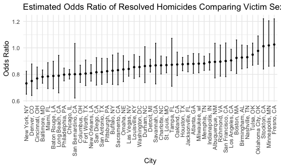

p8105_hw6_yh3824
================
ruby
2025-11-18

load packages/formatting

``` r
library(tidyverse)
library(mgcv)
library(modelr)
library(p8105.datasets)


knitr::opts_chunk$set(
  fig.width = 6,
  fig.asp = .6,
  out.width = "90%"
)

theme_set(theme_minimal() + theme(legend.position = "bottom"))

options(
  ggplot2.continuous.colour = "viridis",
  ggplot2.continuous.fill = "viridis"
)

scale_colour_discrete = scale_colour_viridis_d
scale_fill_discrete = scale_fill_viridis_d

set.seed(1)
```

## Problem 1

import `homicide` data

``` r
homicide_df = read_csv(file = "./data/homicide-data.csv")
```

Create a `city_state` variable, filtering, make resolved vs unresolved
variable

``` r
homicide_df = 
  homicide_df |> 
    mutate(
      city_state = paste(city, state, sep = ", "),
      victim_age = as.numeric(victim_age),
      resolved = if_else(str_detect(disposition, "Closed"), 1, 0) 
    ) |> 
  filter(!city_state %in% c("Dallas, TX", "Phoenix, AZ", "Kansas City, MO", "Tulsa, AL"),
         victim_race %in% c("White", "Black"),
         is.numeric(victim_age)) 
```

    ## Warning: There was 1 warning in `mutate()`.
    ## ℹ In argument: `victim_age = as.numeric(victim_age)`.
    ## Caused by warning:
    ## ! NAs introduced by coercion

`glm` to fit logistic regression for Baltimore, MD

``` r
baltimore_df =
  homicide_df |> 
    filter(city_state == "Baltimore, MD") 

fit = lm(resolved ~ victim_age + victim_sex + victim_race, data = baltimore_df) |> 
  broom::tidy()
```

write a function `lm` for all cities

``` r
lm_resolved = function(df) {
  
  lm(resolved ~ victim_age + victim_sex + victim_race, data = df)
}

homicide_df |> 
  filter(city_state == "Baltimore, MD") |> 
  lm_resolved() |> 
  broom::tidy()
```

    ## # A tibble: 4 × 5
    ##   term             estimate std.error statistic  p.value
    ##   <chr>               <dbl>     <dbl>     <dbl>    <dbl>
    ## 1 (Intercept)       0.654    0.0399       16.4  1.19e-57
    ## 2 victim_age       -0.00118  0.000751     -1.57 1.17e- 1
    ## 3 victim_sexMale   -0.247    0.0327       -7.55 6.10e-14
    ## 4 victim_raceWhite  0.209    0.0409        5.10 3.69e- 7

iterate to fit a model for each city

``` r
resolved_lm_results =
  homicide_df |> 
  nest(data = -city_state) |> 
  mutate(
    fits = map(data, lm_resolved),
    results = map(fits, ~ broom::tidy(.x, conf.int = TRUE) |> 
                    mutate(
                      odds_ratio = exp(estimate),
                      or_low = exp(conf.low),
                      or_high = exp(conf.high)
                    ))
  ) |> 
  select(city_state, results) |> 
  unnest(results) |> 
  filter(term == "victim_sexMale") |> 
  select(city_state, term, odds_ratio, or_low, or_high, everything())
```

create a plot that shows estimate ORs and CIs for each city, organize
cities according to estimate OR

``` r
resolved_lm_results |> 
  mutate(
      city_state = fct_reorder(city_state, odds_ratio), y = odds_ratio) |> 
  ggplot(aes(x = city_state, y = odds_ratio)) +
  geom_point(size = 1) +
  geom_errorbar(aes(ymin = or_low, ymax = or_high), width = 0.2) +
  labs(
    x = "City",
    y = "Odds Ratio",
    title = "Estimated Odds Ratio of Resolved Homicides Comparing Victim Sex"
  ) +
    theme(axis.text.x = element_text(angle = 90, hjust = 1, vjust = 0.5))
```



### Comments on Plot

xxxx

## Problem 2

import `weather_df`

``` r
data("weather_df")
```

## Problem 3

import `birthweight` dataset

``` r
birthwgt_df = read_csv(file = "./data/birthweight.csv")
```
