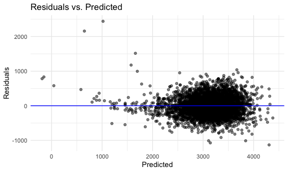
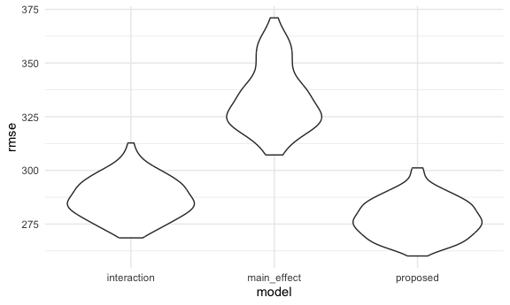

p8105_hw6_yh3824
================
ruby
2025-11-18

load packages/formatting

``` r
library(tidyverse)
library(mgcv)
library(modelr)


knitr::opts_chunk$set(
  fig.width = 6,
  fig.asp = .6,
  out.width = "90%"
)

theme_set(theme_minimal() + theme(legend.position = "bottom"))

options(
  ggplot2.continuous.colour = "viridis",
  ggplot2.continuous.fill = "viridis"
)

scale_colour_discrete = scale_colour_viridis_d
scale_fill_discrete = scale_fill_viridis_d

set.seed(1)
```

## Problem 1

import `homicide` data

``` r
homicide_df = read_csv(file = "./data/homicide-data.csv")
```

Create a `city_state` variable, filtering, make resolved vs unresolved
variable

``` r
homicide_df = 
  read_csv(file = "./data/homicide-data.csv") |> 
  janitor::clean_names() |> 
    mutate(
      city_state = str_c(city, ", ", state),
      victim_age = as.numeric(victim_age),
      resolved = as.numeric(disposition == "Closed by arrest") 
    ) |> 
  filter(!city_state %in% c("Dallas, TX", "Phoenix, AZ", "Kansas City, MO", "Tulsa, AL"),
         victim_race %in% c("White", "Black")) |>
  select(city_state, resolved, victim_age, victim_sex, victim_race)
```

`glm` to fit logistic regression for Baltimore, MD and output odds ratio
and confidence interval

``` r
baltimore_df =
  homicide_df |> 
    filter(city_state == "Baltimore, MD") 

baltimore_glm = glm(resolved ~ victim_age + victim_sex + victim_race, data = baltimore_df, family = binomial()) 

baltimore_glm |> 
  broom::tidy(conf.int = TRUE) |> 
  filter(term == "victim_sexMale") |> 
  mutate(
    odds_ratio = exp(estimate),
    conf_low = exp(conf.low),
    conf_high = exp(conf.high)
  ) |> 
  select(odds_ratio, conf_low, conf_high) |> 
  knitr::kable(digits = 3)
```

| odds_ratio | conf_low | conf_high |
|-----------:|---------:|----------:|
|      0.426 |    0.324 |     0.558 |

write a function for all cities

``` r
glm_resolved = function(df) {
  
  model = glm(resolved ~ victim_age + victim_sex + victim_race, data = df, family = binomial())

}
```

produce odds ratios and confidence interval for all cities

``` r
resolved_glm_results =
  homicide_df |> 
  nest(data = -city_state) |> 
  mutate(
    fits = map(data, glm_resolved),
    results = map(fits, ~ broom::tidy(.x, conf.int = TRUE) |> 
                    mutate(
                      odds_ratio = exp(estimate),
                      or_low = exp(conf.low),
                      or_high = exp(conf.high)
                    ))
  ) |> 
  select(city_state, results) |> 
  unnest(results) |> 
  filter(term == "victim_sexMale") |> 
  select(city_state, odds_ratio, or_low, or_high)

resolved_glm_results |> 
  knitr::kable(digits = 3)
```

| city_state         | odds_ratio | or_low | or_high |
|:-------------------|-----------:|-------:|--------:|
| Albuquerque, NM    |      1.767 |  0.825 |   3.762 |
| Atlanta, GA        |      1.000 |  0.680 |   1.458 |
| Baltimore, MD      |      0.426 |  0.324 |   0.558 |
| Baton Rouge, LA    |      0.381 |  0.204 |   0.684 |
| Birmingham, AL     |      0.870 |  0.571 |   1.314 |
| Boston, MA         |      0.674 |  0.353 |   1.277 |
| Buffalo, NY        |      0.521 |  0.288 |   0.936 |
| Charlotte, NC      |      0.884 |  0.551 |   1.391 |
| Chicago, IL        |      0.410 |  0.336 |   0.501 |
| Cincinnati, OH     |      0.400 |  0.231 |   0.667 |
| Columbus, OH       |      0.532 |  0.377 |   0.748 |
| Denver, CO         |      0.479 |  0.233 |   0.962 |
| Detroit, MI        |      0.582 |  0.462 |   0.734 |
| Durham, NC         |      0.812 |  0.382 |   1.658 |
| Fort Worth, TX     |      0.669 |  0.394 |   1.121 |
| Fresno, CA         |      1.335 |  0.567 |   3.048 |
| Houston, TX        |      0.711 |  0.557 |   0.906 |
| Indianapolis, IN   |      0.919 |  0.678 |   1.241 |
| Jacksonville, FL   |      0.720 |  0.536 |   0.965 |
| Las Vegas, NV      |      0.837 |  0.606 |   1.151 |
| Long Beach, CA     |      0.410 |  0.143 |   1.024 |
| Los Angeles, CA    |      0.662 |  0.457 |   0.954 |
| Louisville, KY     |      0.491 |  0.301 |   0.784 |
| Memphis, TN        |      0.723 |  0.526 |   0.984 |
| Miami, FL          |      0.515 |  0.304 |   0.873 |
| Milwaukee, wI      |      0.727 |  0.495 |   1.054 |
| Minneapolis, MN    |      0.947 |  0.476 |   1.881 |
| Nashville, TN      |      1.034 |  0.681 |   1.556 |
| New Orleans, LA    |      0.585 |  0.422 |   0.812 |
| New York, NY       |      0.262 |  0.133 |   0.485 |
| Oakland, CA        |      0.563 |  0.364 |   0.867 |
| Oklahoma City, OK  |      0.974 |  0.623 |   1.520 |
| Omaha, NE          |      0.382 |  0.199 |   0.711 |
| Philadelphia, PA   |      0.496 |  0.376 |   0.650 |
| Pittsburgh, PA     |      0.431 |  0.263 |   0.696 |
| Richmond, VA       |      1.006 |  0.483 |   1.994 |
| San Antonio, TX    |      0.705 |  0.393 |   1.238 |
| Sacramento, CA     |      0.669 |  0.326 |   1.314 |
| Savannah, GA       |      0.867 |  0.419 |   1.780 |
| San Bernardino, CA |      0.500 |  0.166 |   1.462 |
| San Diego, CA      |      0.413 |  0.191 |   0.830 |
| San Francisco, CA  |      0.608 |  0.312 |   1.155 |
| St. Louis, MO      |      0.703 |  0.530 |   0.932 |
| Stockton, CA       |      1.352 |  0.626 |   2.994 |
| Tampa, FL          |      0.808 |  0.340 |   1.860 |
| Tulsa, OK          |      0.976 |  0.609 |   1.544 |
| Washington, DC     |      0.690 |  0.465 |   1.012 |

create a plot that shows estimate ORs and CIs for each city, organize
cities according to estimate OR

``` r
resolved_glm_results |> 
  mutate(
      city_state = fct_reorder(city_state, odds_ratio), y = odds_ratio) |> 
  ggplot(aes(x = city_state, y = odds_ratio)) +
  geom_point(size = 1) +
  geom_errorbar(aes(ymin = or_low, ymax = or_high), width = 0.2) +
  labs(
    x = "City",
    y = "Odds Ratio",
    title = "Estimated Odds Ratio of Resolved Homicides Comparing Victim Sex"
  ) +
    theme(axis.text.x = element_text(angle = 90, hjust = 1, vjust = 0.5))
```


### Comments on Plot

When looking at the 50 large U.S. cities, Albuquerque, NM has the
highest estimated odds ratios (OR = 1.77, 95% CI: 0.825, 3.76) for
homicides being resolved when comparing male to female victims. New
York, NY has the lowest estimated odds ratio (OR = 0.262, 95% CI: 0.133,
0.485). There does not appear to be any sort of geographic trend for the
odds ratios, but most cities have an odds ratio of less than 1. Just by
looking at the plot, approximately 24 cities have a 95% confidence
interval that crosses the null of 1, indicating that the odds ratio is
insignificant. This includes the highest value of Albuquerque, NM.

## Problem 2

import `weather_df`

``` r
library(p8105.datasets)
data("weather_df")
```

write function for lm, r_square, and beta1/beta2

``` r
boot_function = function(df) {
  boot_df = df |> 
    sample_frac(size = 1, replace = TRUE)
  fit = lm(tmax ~ tmin + prcp, data = boot_df)
  r_squared = broom::glance(fit) |> 
    pull(r.squared)
  beta_1 = broom::tidy(fit) |> 
    filter(term == "tmin") |> 
    pull(estimate) 
  beta_2 = broom::tidy(fit) |> 
    filter(term == "prcp") |> 
    pull(estimate) 
  beta_ratio = beta_1/beta_2
  
  tibble(r_squared = r_squared, beta_ratio = beta_ratio)
}
```

test function

``` r
boot_function(weather_df) 
```

    ## # A tibble: 1 × 2
    ##   r_squared beta_ratio
    ##       <dbl>      <dbl>
    ## 1     0.941      -202.

generate 5000 datasets

``` r
weather_sample = 
  tibble(
    iter = 1:5000
  ) |> 
  mutate(
    sample = map(iter, \(i) boot_function(df = weather_df))
  ) |> 
  unnest(sample)
```

plot the distribution of r_squared

``` r
weather_sample |> 
  ggplot(aes(x = r_squared)) +
  geom_histogram() +
  labs(
    title = "Distibution of R squared",
    x = "R-squared",
    y = "Count"
  )
```


### Comments

The distribution of r-squared appears to be approximately normally
distributed with the center falling at around 0.92. The range appears to
be between 0.93, 0.95.

plot the distribution of beta_1/beta_2

``` r
weather_sample |> 
  ggplot(aes(x = beta_ratio)) +
  geom_histogram() +
  labs(
    title = "Distribution of beta1/beta2",
    x = "Beta Ratio",
    y = "Count"
  )
```


### Comments

The distribution of the beta1/beta2 proportion appears to be left
skewed, with a peak at around -175 and a range between -400, -100.

identify 2.5% and 97.5% quantiles to find 95% confidence intervals for
r_squared

``` r
weather_sample |> 
  summarize(
    r_sq_lower_ci = quantile(r_squared, 0.025),
    r_sq_upper_ci = quantile(r_squared, 0.975)
  ) |> 
  knitr::kable(digits = 3)
```

| r_sq_lower_ci | r_sq_upper_ci |
|--------------:|--------------:|
|         0.934 |         0.947 |

identify 2.5% and 97.5% quantiles to find 95% confidence intervals for
beta_1/beta_2

``` r
weather_sample |> 
  summarize(
    beta_lower_ci = quantile(beta_ratio, 0.025),
    beta_upper_ci = quantile(beta_ratio, 0.975)
  ) |> 
  knitr::kable(digits = 3)
```

| beta_lower_ci | beta_upper_ci |
|--------------:|--------------:|
|      -279.749 |      -125.686 |

## Problem 3

import `birthweight` dataset

``` r
birthwgt_df = read_csv(file = "./data/birthweight.csv")
```

look at and clean data

``` r
clean_birthwgt =
  birthwgt_df |> 
  janitor::clean_names() |> 
  mutate(
    babysex = factor(babysex, levels = c(1,2), labels = c("male","female")),
    frace = factor(frace, levels = c(1,2,3,4,8,9), labels = c("White", "Black", "Asian", "Puerto Rican", "Other", "Unknown")),
    mrace = factor(mrace,levels = c(1,2,3,4,8,9), labels = c("White", "Black", "Asian", "Puerto Rican", "Other", "Unknown")),
    malform = factor(malform, levels = c(0,1), labels = c("absent","present"))
  )
```

check for missing values

``` r
colSums(is.na(clean_birthwgt))
```

    ##  babysex    bhead  blength      bwt    delwt  fincome    frace  gaweeks 
    ##        0        0        0        0        0        0        0        0 
    ##  malform menarche  mheight   momage    mrace   parity  pnumlbw  pnumsga 
    ##        0        0        0        0        0        0        0        0 
    ##    ppbmi     ppwt   smoken   wtgain 
    ##        0        0        0        0

no missing values

Propose a model:

``` r
proposed_model = lm(bwt ~ gaweeks + bhead + blength + babysex + momage + smoken + mrace, data = clean_birthwgt)

summary(proposed_model) 
```

    ## 
    ## Call:
    ## lm(formula = bwt ~ gaweeks + bhead + blength + babysex + momage + 
    ##     smoken + mrace, data = clean_birthwgt)
    ## 
    ## Residuals:
    ##      Min       1Q   Median       3Q      Max 
    ## -1130.43  -188.07    -7.75   176.99  2440.90 
    ## 
    ## Coefficients:
    ##                     Estimate Std. Error t value Pr(>|t|)    
    ## (Intercept)       -5815.2659   102.6441 -56.655  < 2e-16 ***
    ## gaweeks              12.2361     1.4851   8.239 2.27e-16 ***
    ## bhead               135.8823     3.4968  38.859  < 2e-16 ***
    ## blength              78.7598     2.0370  38.664  < 2e-16 ***
    ## babysexfemale        31.8031     8.6257   3.687  0.00023 ***
    ## momage                1.3069     1.1728   1.114  0.26522    
    ## smoken               -4.2241     0.5957  -7.092 1.54e-12 ***
    ## mraceBlack         -135.0985     9.8705 -13.687  < 2e-16 ***
    ## mraceAsian         -121.6660    43.1940  -2.817  0.00487 ** 
    ## mracePuerto Rican  -134.7109    19.1054  -7.051 2.06e-12 ***
    ## ---
    ## Signif. codes:  0 '***' 0.001 '**' 0.01 '*' 0.05 '.' 0.1 ' ' 1
    ## 
    ## Residual standard error: 278.1 on 4332 degrees of freedom
    ## Multiple R-squared:  0.7057, Adjusted R-squared:  0.7051 
    ## F-statistic:  1154 on 9 and 4332 DF,  p-value: < 2.2e-16

In my predicted model I included gestational age in weeks, baby head
circumference at birth, baby length at birth, baby sex, mother’s age at
delivery, mother’s race, and average number of cigarettes smoked per day
during pregnancy.

I picked these variables for both statistical reasoning and existing
evidence. I initially included gestational age, baby head circumference,
and baby length due to the fact that a baby with a larger head
circumference and length are more likely to weight more. Additionally,
pre-term babies will be lighter in comparison to full term babies, so it
would make sense to include gestational age as a predictor. There is
existing evidence that indicates maternal health and associated
demographic factors also influence birthweight, so the variables of
smoking and race were also included.

I tested multiple models including these variables and others to
determine which one would be most “optimal” to model birthweight, but
other models did not show significant differences in p-value and
R-squared, which indicated to me that they did not significantly impact
the model. In order to keep the model parsimonious, I decided on
including `gaweeks`, `bhead`, `blength`, `babysex`, `momage`, `smoken`,
and `mrace`.

residual and predicted plot

``` r
clean_birthwgt |> 
  add_predictions(proposed_model) |> 
  add_residuals(proposed_model) |> 
  ggplot(aes(x = pred, y = resid)) +
  geom_point(alpha = 0.5) +
  geom_hline(yintercept = 0, color = "blue") +
  labs(
    title = "Residuals vs. Predicted",
    x = "Predicted",
    y = "Residuals"
  )
```



Residuals appear to be evenly distributed around 0.

Make a model with main effects only

``` r
main_effect_model = lm(bwt ~ gaweeks + blength, data = clean_birthwgt)
```

Make a model with interactions

``` r
interaction_model = lm(bwt ~ bhead * blength * babysex, data = clean_birthwgt)
```

cross-validate

``` r
cross_validate = 
  crossv_mc(clean_birthwgt, n = 100) |> 
  mutate(
    train = map(train, as_tibble),
    test = map(test, as_tibble)
  )

cross_validate = 
  cross_validate |> 
  mutate(
    proposed = map(train, \(df) lm(bwt ~ gaweeks + bhead + blength + momage + smoken + babysex + mrace, data = clean_birthwgt)),
    main_effect = map(train, \(df) lm(bwt ~ gaweeks + blength, data = clean_birthwgt)),
    interaction = map(train, \(df) lm(bwt ~ bhead * blength * babysex, data = clean_birthwgt))
  ) |> 
  mutate(
    rmse_proposed = map2_dbl(proposed, test, rmse),
    rmse_main_effect = map2_dbl(main_effect, test, rmse),
    rmse_interaction = map2_dbl(interaction, test, rmse)
  )
```

create violin plots to visualize

``` r
cross_validate |> 
  select(starts_with("rmse")) |> 
  pivot_longer(
    everything(),
    names_to = "model",
    values_to = "rmse",
    names_prefix = "rmse_"
  ) |> 
  ggplot(aes(x = model, y = rmse)) +
  geom_violin()
```



It appears that my proposed model has the lowest RMSE, which could
indicate that it will be the best at predicting baby’s birthweight in
comparison to the other 2 models. The interaction model also has pretty
low RMSE, so it could also adequately predict birthweight. However the
main effect model performs the worst in accurately predicting
birthweight.
